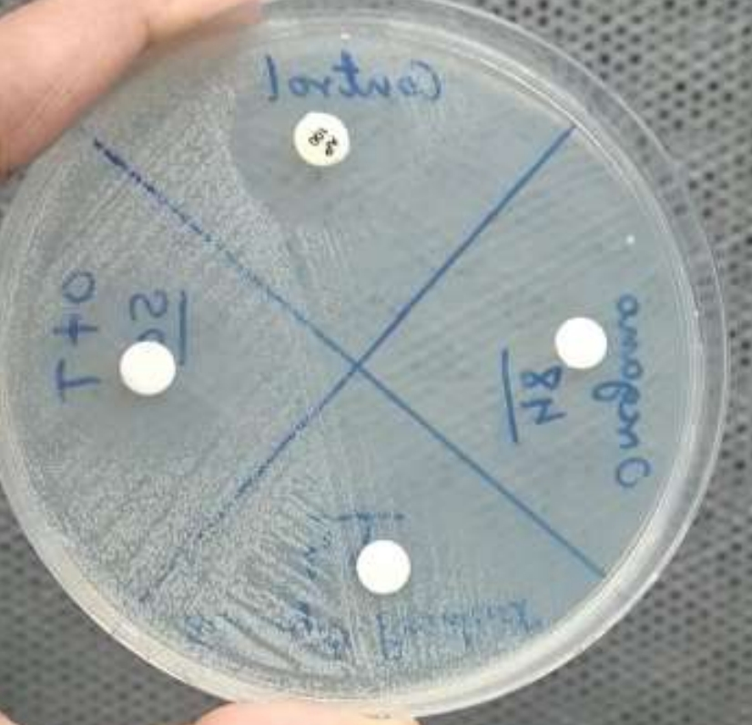
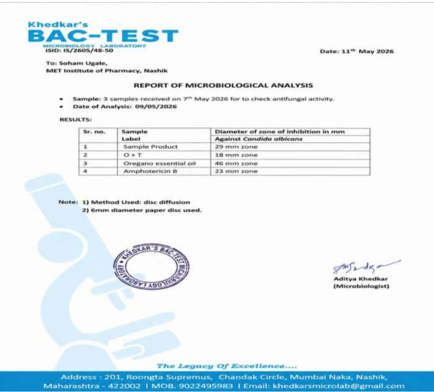

# Biphasic Herbal Anti-Dandruff Serum 🌿

> A B.Pharm final year project — formulation, optimization, and evaluation of a biphasic herbal anti-dandruff serum using Oregano Essential Oil and Tea Tree Oil, with external microbiological antifungal validation against Candida albicans.

*Year:* 2025–2026 &nbsp;|&nbsp; *Authors:* Soham Ugale, Sohum Waskar &nbsp;|&nbsp; *Guide:* Dr. Sanjay J. Kshirsagar  
*Institution:* MET's Institute of Pharmacy, Bhujbal Knowledge City, Nashik — Savitribai Phule Pune University

---

## 🎯 Background & Problem Statement

Dandruff (Pityriasis capitis) is one of the most common scalp disorders worldwide, primarily driven by Malassezia furfur overgrowth. Conventional anti-dandruff products — medicated shampoos, lotions, topical antifungals — suffer from:

- Short scalp contact time
- Frequent re-application requirements
- Inadequate penetration of active ingredients
- Scalp dryness and irritation with prolonged synthetic use

This project develops a *biphasic herbal serum* — a modern topical delivery system combining an oil phase (essential oils + carrier oil) and an aqueous phase — to overcome these limitations using natural bioactive agents.

---

## 🔬 Pipeline Overview

Literature Review & Ingredient Selection
        ->
Formulation Development — 12 Trial Batches
        ->
Screening → 5 Acceptable Batches Identified
        ->
2 Best Batches (F1 & F2) Selected for Full Evaluation
        ->
Physical Evaluation (pH, Viscosity, Spreadability, Appearance)
        ->
Stability Testing — 30 Days (RT + Accelerated)
        ->
F2 Selected as Optimized Batch (Stable over 30 days)
        ->
External Antifungal Testing — Khedkar's BAC-TEST Microbiology Lab
    -Disc Diffusion vs Candida albicans

---

## 🧪 Ingredients & Their Roles

| Ingredient | Role |
|-----------|------|
| *Oregano Oil* | Antifungal — carvacrol & thymol active constituents |
| *Tea Tree Oil* | Antifungal & Anti-inflammatory |
| Coconut Oil | Moisturizer, scalp nourishment, mild antifungal (Caprylic Acid) |
| TWEEN 80 | Oil solubilizer (biphasic emulsification) |
| Propylene Glycol | Cosolvent |
| Glycerin | Humectant & moisturizer |
| Methyl Paraben | Preservative |
| Propyl Paraben | Preservative |
| Distilled Water | Solvent (aqueous phase) |

---

## ⚗️ Formulation Development & Optimization

12 trial batches were prepared. After screening for homogeneity, phase stability, appearance, and initial physicochemical parameters, *5 batches met acceptable criteria. From these, **2 batches (F2 and F3)* were shortlisted for full evaluation.

### Formulation Table — All 5 Acceptable Batches (amounts in ml unless noted)

| Ingredients | Batch 1 (25 ml) | Batch 2 (50 ml) | Batch 3 (50 ml) | Batch 4 (50 ml) | Batch 5 (50 ml) |
|-------------|:--------------:|:--------------:|:--------------:|:--------------:|:--------------:|
| Oregano oil | 0.25 | 0.3 | 0.7 | 0.4 | 0.6 |
| Tea tree oil | 0.25 | 0.5 | 0.5 | 0.6 | 0.3 |
| Coconut oil | 2.5 | 5 | 5 | 4 | 6 |
| Propylene Glycol | 5 | 5 | 5 | 6 | 4 |
| TWEEN 80 | 1 | 2 | 2 | 2.5 | 1.5 |
| Glycerin | 2.5 | 5 | 5 | 4 | 6 |
| Methyl Paraben | 0.05 g | 0.1 g | 1 g | 0.1 g | 0.15 g |
| Propyl Paraben | 0.005 g | 0.02 g | 0.02 g | 0.02 g | 0.015 g |
| Distilled Water | Qs to 25 ml | Qs to 50 ml | Qs to 50 ml | Qs to 50 ml | Qs to 50 ml |

> Batches 1 & 2 (corresponding to *F1 and F2*) were selected as the two best performers based on appearance, homogeneity, and initial stability.

---

## 📊 Physical Evaluation Results — F1 vs F2

| Parameter | Batch F2 | Batch F3 | Remark |
|-----------|:--------:|:--------:|--------|
| *Appearance* | Clear, homogeneous | Clear, homogeneous | Both acceptable |
| *Phase Separation* | None | None | Stable biphasic system |
| *pH* | 6.0 | 6.2 | ✅ Within scalp pH range (4.5–6.5) |
| *Viscosity (cP)* | 227 | 236 | Good spreadability |
| *Oil Phase Content* | 11.6% | 12.4% | Adequate active delivery |
| *Drug Content — Oregano Oil* | 0.6% | 1% | F2 higher active concentration |
| *Drug Content — Tea Tree Oil* | 1% | 1% | Equal in both |
| *Skin Irritation (Patch Test)* | None | None | ✅ Dermatologically safe |

---

## 🧪 Stability Testing — 30 Days

Both F2 and F3 were subjected to stability testing under room temperature (25°C/60% RH) and accelerated conditions (40°C/75% RH) for 30 days, monitoring pH, viscosity, appearance, and phase separation.

> ✅ *Batch F2 remained stable across all parameters over 30 days* and was selected as the optimized final formulation for external antifungal testing.

---

## 🦠 Antifungal Testing — External Microbiological Report

*Testing Laboratory:* Khedkar's BAC-TEST Microbiology Laboratory, Nashik  
*Report Date:* 11th May 2026 | *ISID:* IS/2605/48-50  
*Method:* Disc Diffusion | *Organism:* Candida albicans  
*Disc Size:* 6 mm diameter paper disc

### Zone of Inhibition Results

| Sr. No. | Sample | Zone of Inhibition (mm) vs C. albicans |
|:-------:|--------|:----------------------------------------:|
| 1 | *Serum Formulation (F2)* | *29 mm* ✅ |
| 2 | Oregano + Tea Tree Oil (O+T blend) | 18 mm |
| 3 | Oregano Essential Oil (pure) | 46 mm |
| 4 | Amphotericin B (standard reference) | 23 mm |

> 🏆 *The optimized serum formulation (F2) produced a 29 mm zone of inhibition against *Candida albicans — exceeding the standard antifungal drug Amphotericin B (23 mm).**  
> Pure Oregano oil showed the highest activity (46 mm), confirming it as the primary active contributor. The formulated serum delivered superior antifungal performance compared to the reference drug even after incorporation into a biphasic delivery system.

### Zone of Inhibition — Disc Diffusion Plate

### Official Antifungal Lab Report — Khedkar's BAC-TEST

---

## ✅ Conclusion

- 12 batches trialled → 5 acceptable → 2 best (F2 & F3) fully evaluated
- *F2 selected* as optimized batch: higher oregano oil concentration (1%), better viscosity (236 cP), stable over 30 days
- F2 serum demonstrated *29 mm zone of inhibition* against C. albicans — outperforming Amphotericin B (23 mm)
- Both formulations were *safe* (no patch test irritation) and *stable* under RT and accelerated conditions
- Biphasic serum design ensures longer scalp contact time and better active penetration vs conventional shampoos

---

## 🛠️ Tools & Instruments

| Tool/Instrument | Purpose |
|----------------|---------|
| Brookfield DV-E Viscometer | Viscosity measurement |
| µ pH System 361 | pH evaluation |
| Disc Diffusion (Agar) | Antifungal zone of inhibition |
| Khedkar's BAC-TEST Lab | External microbiological validation |

---

## 👤 Author

*Soham Ugale* — B.Pharm, GCP Certified (ICH E6 R2)  
📧 sohamu2602@gmail.com | [LinkedIn](https://linkedin.com/in/soham-c-ugale-3a66b5299)

---

## 📚 References

- Kligman AM et al. (1974) — Appraisal of efficacy of antidandruff formulations. J Soc Cosmet Chem, 25(2):73-91
- Hay RJ (2011) — Malassezia, dandruff and seborrhoeic dermatitis. Br J Dermatology, 165(s2):2-8
- Satchell AC et al. (2002) — Treatment of dandruff with 5% tea tree oil shampoo. JAAD, 47(6):852-5
- Carson CF et al. (2006) — Tea tree oil: a review of antimicrobial and medicinal properties. Clin Microbiol Rev, 19(1):50-62
- Leyva-López N et al. (2017) — Essential oils of oregano: Biological activity beyond antimicrobial properties. Molecules, 22(6):989
- Moghrovyan A & Sahakyan N (2024) — Antimicrobial activity of Origanum vulgare L. essential oil. AIMS Biophysics, 11(4):508-526
- Sheth U & Dande P (2021) — Pityriasis capitis: Causes, pathophysiology, current modalities. J Cosmet Dermatol, 20(1):35-47
- Gupta AK et al. (2025) — Understanding the Scalp: Dandruff and Seborrheic Dermatitis. J Cutan Med Surg, 29(5_suppl):20S-26S
- Chaudhari PG et al. (2025) — A Review on Herbal Hair Serum. Res J Sci Technol, 17(4):331-338
